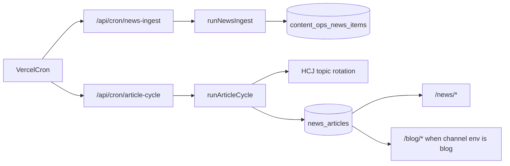

# HCJ Schedules and Trigger Chain

Audit timestamp: 2026-08-11 11:41 Asia/Shanghai. Source evidence: `vercel.json`, `src/app/api/cron/*`, `src/lib/content-ops/*`, database `content_ops_runs` and `content_ops_publishing_logs`.

| Task | Production entry | Current schedule / zone | Reads | Writes | Can publish? | Latest observed result | Required treatment |
| --- | --- | --- | --- | --- | --- | --- | --- |
| Sitemap maintenance | `/api/cron/sitemap` | `20 2 */3 * *` UTC | sitemap sources | sitemap run/log tables, optional Search Console submission | No content publication | Existing 72-hour submission guard documented | Retain; keep independent of News publication |
| Candidate ingest | `/api/cron/news-ingest` -> `runNewsIngest()` | `15 1 * * *` UTC (daily) | code-owned RSS whitelist | `content_ops_news_sources`, `content_ops_news_items`, `content_ops_runs` | No | 2026-08-11 01:15:31 UTC, success, 19 candidates | Replace with 12-hour site-scoped ingest and strict candidate state machine |
| Article cycle | `/api/cron/article-cycle` -> `runArticleCycle()` | `25 1 */2 * *` UTC (calendar every second day) | hard-coded topic rotation, content records | `content_ops_article_records`, `news_articles`, logs | Yes, current environment permits it | 2026-08-11 02:12:24 UTC, News published with no external source; cache invalidation false | Replace with 48-hour site-scoped News publication controller; remove Blog target entirely |
| Historic legacy automation | Removed files / disabled `sync_sources.code='news-automation'` | None | N/A | Historic data retained | No | Disabled by migration 008 | Retain disabled state; do not re-enable |
| Blog manual publishing | Admin/CMS workflow | User action | Blog records | `news_articles` channel `blog` | Yes, manually only | Existing historical content retained | Retain; no News worker access |

## Trigger and dependency chain

The existing chain has no dependency from selected candidate to publication, and the channel is controlled by a mutable environment value. The replacement must instead use `site_id`, a 48-hour cycle key, a lock, reserved candidate IDs, preflight records, delivery verification records and an immutable `news` target.

## Time-zone finding

Vercel cron expressions are evaluated in UTC. The current content configuration uses Asia/Shanghai, while the database session reports GMT. The new controller must calculate the 12-hour and 48-hour windows in each site configuration time zone and use cron as a frequent tick, rather than assuming a calendar expression is an exact rolling 48-hour interval.
